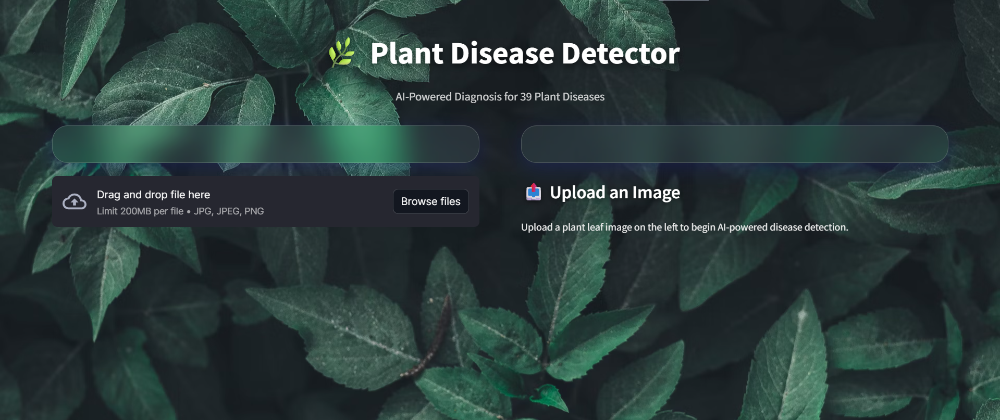
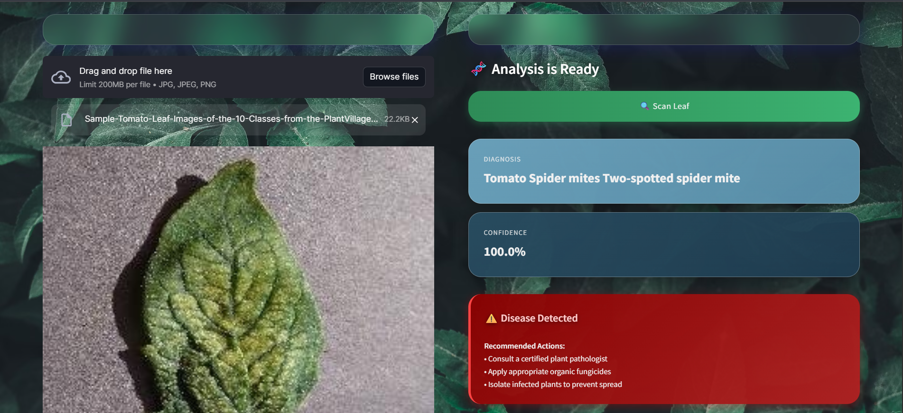
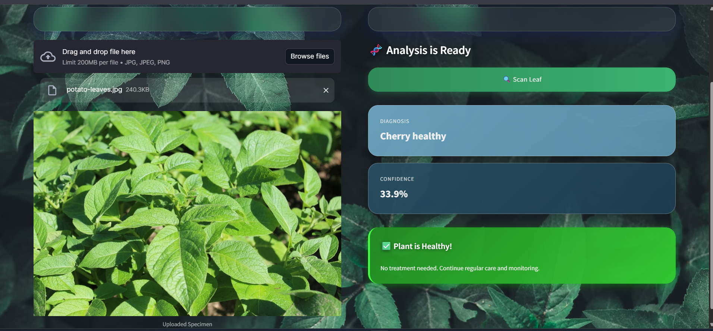

# 🌿 Plant Disease Detector

> **AI-powered plant disease classification system achieving 98.23% accuracy across 39 disease classes**

[](https://huggingface.co/spaces/Zaayan/plant-disease-detector-adnan)
[](https://www.python.org/)
[](https://streamlit.io/)
[](https://pytorch.org/)

---

## 🎯 Problem Statement

Farmers globally lose **20-40% of their crops** to plant diseases annually. Manual disease identification is:
- ❌ Slow and expensive
- ❌ Requires expert agronomists
- ❌ Often inaccurate in early stages

**Solution:** Instant AI-powered diagnosis through leaf image analysis.

---

## 💡 Features

- 🚀 **Real-time prediction** - Results in under 2 seconds
- 🎯 **98.23% accuracy** - Trained on 55,448 professional images
- 🌿 **39 disease classes** - Covers major crops (Tomato, Corn, Apple, Grape, Potato, etc.)
- ⚠️ **Confidence threshold** - Warns users about uncertain diagnoses
- 📱 **Responsive UI** - Works on desktop and mobile
- 🎨 **Modern design** - Glassmorphism effects with professional color palette

---

## 🚀 Live Demo

**Try it now:** [Plant Disease Detector on Hugging Face](https://huggingface.co/spaces/Zaayan/plant-disease-detector-adnan)

### Screenshots

| Upload Interface | Disease Detection | Healthy Plant |
|------------------|-------------------|---------------|
|  |  |  |

---

## 🛠️ Technical Stack

| Component | Technology |
|-----------|------------|
| **Model** | EfficientNet-B0 (Transfer Learning) |
| **Framework** | PyTorch |
| **Frontend** | Streamlit |
| **Deployment** | Hugging Face Spaces |
| **Training** | Google Colab (Tesla T4 GPU) |
| **Dataset** | PlantVillage (55,448 images) |

---

## 📊 Model Performance
```
Validation Accuracy:  98.23%
Training Time:        17.5 minutes
Dataset Size:         55,448 images
Number of Classes:    39 plant diseases
Model Size:           16.1 MB
```

### Supported Diseases

**Tomato (10 classes):**
- Bacterial Spot • Early Blight • Late Blight • Leaf Mold • Septoria Leaf Spot • Spider Mites • Target Spot • Mosaic Virus • Yellow Leaf Curl • Healthy

**Corn (4 classes):**
- Common Rust • Gray Leaf Spot • Northern Leaf Blight • Healthy

**Apple (4 classes):**
- Apple Scab • Black Rot • Cedar Apple Rust • Healthy

**+ 8 more crop types** (Grape, Potato, Pepper, Peach, Cherry, Strawberry, Raspberry, Blueberry)

---

## 🔧 Local Installation

### Prerequisites
```bash
Python 3.8+
pip
```

### Setup

1. **Clone the repository**
```bash
git clone https://github.com/adnanjitu15/plant-disease-detector.git
cd plant-disease-detector
```

2. **Install dependencies**
```bash
pip install -r requirements.txt
```

3. **Download model files**
- Download `plant_disease_efficientnet_b0.pth` (16.1 MB)
- Download `class_mapping.json`
- Place both in the project root directory

4. **Run the application**
```bash
streamlit run app.py
```

5. **Open in browser**
```
http://localhost:8501
```

---

## 📁 Project Structure
```
plant-disease-detector/
├── app.py                              # Main Streamlit application
├── plant_disease_efficientnet_b0.pth  # Trained model weights
├── class_mapping.json                  # Disease class labels
├── requirements.txt                    # Python dependencies
├── README.md                           # Project documentation
└── screenshots/                        # Demo images
    ├── upload.png
    ├── disease_detected.png
    └── healthy.png
```

---

## 🧠 Model Training Details

### Architecture
- **Base Model:** EfficientNet-B0 (pretrained on ImageNet)
- **Output Layer:** 39-class softmax classifier
- **Input Size:** 224×224 RGB images

### Training Configuration
```python
Optimizer:        Adam (lr=0.001)
Loss Function:    CrossEntropyLoss
Batch Size:       32
Epochs:           3
Train/Val Split:  80/10/10
Augmentation:     RandomCrop, HorizontalFlip, Rotation, ColorJitter
```

### Data Preprocessing
```python
transforms.Compose([
    transforms.Resize((224, 224)),
    transforms.ToTensor(),
    transforms.Normalize(
        mean=[0.485, 0.456, 0.406],
        std=[0.229, 0.224, 0.225]
    )
])
```

---

## ⚠️ Known Limitations

### Domain Shift
The model was trained on **isolated leaf images** with controlled lighting. It may produce less reliable results for:
- Whole plant images (not single leaves)
- Outdoor photos with unusual lighting
- Images with soil/background clutter

**Mitigation:** The app includes user guidelines and confidence threshold warnings (< 95%) to flag uncertain diagnoses.

### Usage Recommendations
For best results:
- ✅ Upload **close-up images** of single leaves
- ✅ Ensure good **lighting** (avoid shadows)
- ✅ Capture **visible symptoms** clearly
- ❌ Avoid full plant photos
- ❌ Avoid low-resolution images

---

## 🎤 How to Talk About This Project (Interview Guide)

### Technical Questions

**Q: "Tell me about your plant disease detector."**

**A:** "I built an end-to-end deep learning application that classifies 39 plant diseases with 98% accuracy. The system uses EfficientNet-B0 with transfer learning, trained on 55,000 images from the PlantVillage dataset. I deployed it as a Streamlit web app on Hugging Face Spaces with a custom glassmorphism UI and implemented confidence thresholding to handle out-of-distribution data."

**Q: "What challenges did you face?"**

**A:** "The biggest challenge was domain shift—the model was trained on isolated leaves but users often upload whole plants. I addressed this by adding confidence warnings and user guidelines. I also debugged deployment issues with Hugging Face Spaces, including state management to prevent result loss on page refresh."

**Q: "What would you improve?"**

**A:** "For production, I'd implement three enhancements: (1) Fine-tune on real-world farmer uploads to reduce domain shift, (2) Add Grad-CAM visualization to highlight diseased regions, and (3) Build a feedback loop to collect misclassifications for continuous model improvement."

---

## 📈 Future Improvements

- [ ] **Grad-CAM Visualization** - Highlight disease regions in the image
- [ ] **Multi-disease Detection** - Detect multiple diseases in one image
- [ ] **Mobile App** - Native iOS/Android deployment
- [ ] **API Endpoint** - RESTful API for third-party integration
- [ ] **Treatment Recommendations** - Link to organic fungicide databases
- [ ] **Real-world Fine-tuning** - Train on farmer-submitted images

---

## 📝 Resume Bullet Point

Use this on your resume:

> *Engineered an end-to-end plant disease classification system achieving **98.23% accuracy** across 39 disease classes using **EfficientNet-B0** and transfer learning; deployed production **Streamlit** web app on **Hugging Face Spaces** serving real-time predictions on 55K+ training images with **confidence thresholding** for out-of-distribution detection.*

---

## 👨‍💻 Author

**Adnan Jitu**  
📧 Email: adnanjitu15@gmail.com  
🐱 GitHub: [@adnanjitu15](https://github.com/adnanjitu15)  
💼 LinkedIn: [Connect with me](https://linkedin.com/in/adnanjitu)  

*Aspiring AI Engineer | Building production-ready ML applications | Passionate about using AI for social impact*

---

## 📄 License

This project is licensed under the MIT License - see the [LICENSE](LICENSE) file for details.

---

## 🙏 Acknowledgments

- **PlantVillage Dataset** - For providing the high-quality training data
- **EfficientNet** - Google's efficient neural network architecture
- **Hugging Face** - For free deployment hosting and community support
- **Streamlit** - For the rapid web app development framework
- **PyTorch** - For the powerful deep learning framework

---

## 🌟 Show Your Support

If this project helped you, please consider:
- ⭐ **Starring** this repository
- 🍴 **Forking** it for your own projects
- 📢 **Sharing** it with others who might benefit

---

## 📞 Get in Touch

Have questions or suggestions? Feel free to:
- 📧 Email me at adnanjitu15@gmail.com
- 🐛 Open an issue on GitHub
- 💬 Connect with me on LinkedIn

---

**Built with ❤️ for sustainable agriculture and AI accessibility**

*Making advanced plant disease diagnosis accessible to farmers worldwide* 🌍🌾
